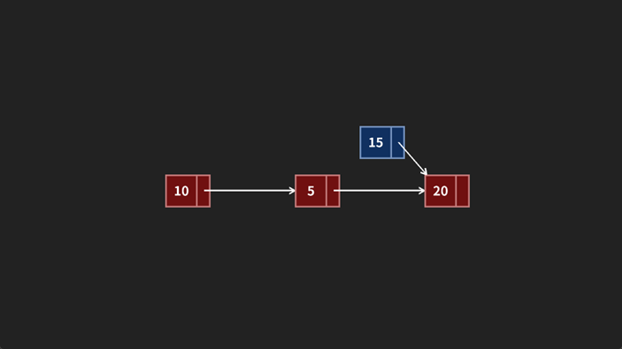
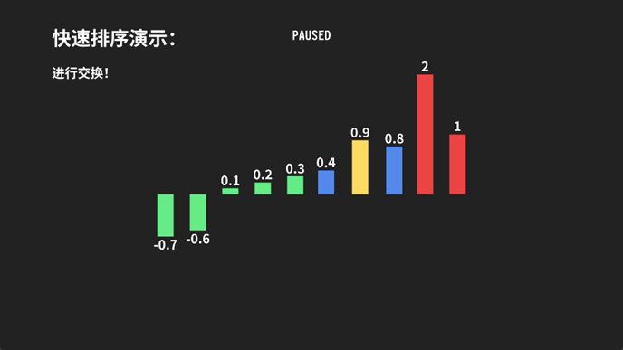
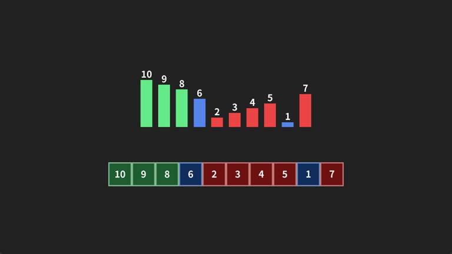

# Algoriscope 算法镜

**可交互算法可视化动画工具**

[](https://isocpp.org/)
[](https://www.opengl.org/)
[](LICENSE)

Algoriscope（算法镜）是一个基于 C++ 与 OpenGL 的算法可视化引擎。它通过**低侵入式**的代码嵌入设计，允许开发者直接在原有算法代码中插入可视化指令，实时生成交互式动画。

不同于传统的录屏或脚本驱动方案，Algoriscope 采用**基于物理的程序式动画**（Procedural Animation），使数据结构的每一个变化都呈现出符合动力学规律的平滑过渡，显著提升算法教学与调试的直观性。

## 特性

- **丰富的可视化元素**：支持条形图、框图、节点、文本标签等，可自定义颜色、大小、位置。
- **流畅的物理动画**：基于运动学方程的程序式动画，提供自然频率、阻尼、输入增益三个参数，可调节动画效果。
- **变量绑定**：直接将图形元素与程序中的变量绑定，图形会根据变量值自动更新，实现“代码即动画”。
- **交互支持**：通过回调函数响应鼠标悬停、点击以及键盘事件，可制作可交互的演示。
- **低耦合设计**：只需在原有算法代码中插入少量动画代码，不影响原有逻辑。
- **树形对象管理**：对象可建立父子关系，子对象基于父对象的相对坐标定位，便于构建复杂场景。

## 依赖

- OpenGL 3.3+
- GLEW
- GLFW
- FreeType
- GLM (OpenGL Mathematics)
- iconv (可选，用于中文编码转换)

## 主要功能

- **变量绑定**：通过 setBind() 将图形与变量关联，图形自动反映变量值。
- **动画参数**：通过 setFZR(f, z, r) 调整动画的固有频率、阻尼和输入增
- **交互回调**：使用 setCallBack() 注册回调函数，响应鼠标和键盘事件。
- **父子关系**：通过 add_child() 建立对象树，子对象位置基于父对象。

## 使用示例

下面是一个简单的冒泡排序可视化示例：

```c++
#include "algoriscope.h"
using namespace Algoriscope;

int main() {
    // 创建场景，窗口大小 1920x1080，目标帧率 100
    Scene scn(1920, 1080, 100);

    // 待排序数组
    float array[10] = {0.3f, -0.6f, -0.7f, 0.2f, 0.8f, 0.1f, 0.9f, 0.4f, 2.0f, 1.0f};
    int n = 10;

    // 创建条形图对象，位置(0, -60)，宽度50，间隔100，初始高度100
    auto bars = new BarArray(Vector2(0, -60.0f), n, 50, 100, 100);
    scn.addIn(bars);
    bars->setBind(array, n);        // 绑定数组
    bars->autoScale(500);           // 自动缩放使最大高度为500像素

    // 添加标题和字幕
    auto title = new Text("冒泡排序演示：", Vector2(-800, 400), 15, "white");
    auto subtitle = new Text("此时进行：", Vector2(-800, 300), 10, "white", "ld");
    scn.addIn(title);
    scn.addIn(subtitle);

    // 冒泡排序动画
    for (int i = n - 1; i >= 0; i--) {
        for (int j = 0; j < i; j++) {
            bars->setDefaultColor("blue", j, j + 1);
            bars->resetColor(j, j + 1);
            subtitle->setContent("比较");
            scn.run(1000);   // 运行动画 1 秒

            if (array[j] < array[j + 1]) {
                std::swap(array[j], array[j + 1]);
                bars->animSwap(j, j + 1);
                subtitle->setContent("进行交换！");
            } else {
                subtitle->setContent("无需交换");
            }
            scn.run(1000);

            bars->setDefaultColor("red", j, j + 1);
            bars->resetColor(j, j + 1);
        }
        bars->setDefaultColor("green", i);
        bars->resetColor(i);
    }

    scn.run(5000);  // 最后停留 5 秒
    return 0;
}
```

## 效果展示




